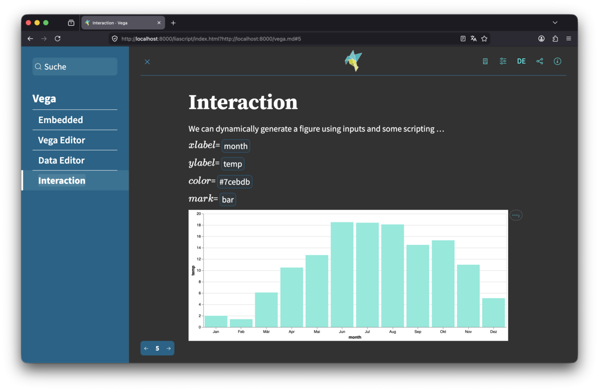

<!--
author:   Martin Schneider
version:  0.0.1
language: en
narrator: US English Female
dark: true
logo: screenshot-vega-liascript-1200.png
comment: extended vega template for liascript
repository: https://github.com/tillylab/vega-liascript-template

script:   https://cdn.jsdelivr.net/npm/vega@6.1.2
          https://cdn.jsdelivr.net/npm/vega-lite@6.4.1
          https://cdn.jsdelivr.net/npm/vega-embed@7.1.0

@Vega.opts
{
  width: 800
}
@end

@Vega.exec: @Vega.exec_(@uid,@Vega.opts)

@Vega.exec_
<script>
  let input = @input;
  input.width = 0;
  vegaEmbed('#vis@0', input, @1);
  "LIA: stop"
</script>

<div id="vis@0"></div>

@end

@Vega.dataexec: @Vega.dataexec_(@uid,@Vega.opts)

@Vega.dataexec_
<script>
  let vega = @input(1);
  vega.data = { values: @input(0) };
  vega.width = 0;
  let opts = @1;
  vegaEmbed('#vis@0', vega, opts);
  "LIA: stop"
</script>

<div id="vis@0"></div>

@end

@Vega.run: @Vega.run_(@uid,```@Vega.opts```,```@0```)

@Vega.run_
<div id="vis@0"></div>

<script>
  let vega = @2;
  vega.width = '';
  vegaEmbed('#vis@0', vega, @1);
  "LIA: stop"
</script>

@end

@hidden: <!-- style="display: none" -->@0
-->

# Vega

Various ways to embed and edit Vega specs and data inside LiaScript. 

- View [LiaScript](https://LiaScript.github.io/course/?https://github.com/tillylab/vega-liascript-template) 
- View [Source](https://github.com/tillylab/vega-liascript-template/blob/main/README.md?plain=1).



## Embedded 

Use the `@Vega.run` macro to embed Vega into Liascript documents.

External JSON
=============

```json @Vega.run
{
  "data": {"url": "https://raw.githubusercontent.com/tillylab/vega-liascript-template/refs/heads/main/temperature.json"},
  "mark": "bar",
  "encoding": {
    "x": {"field": "month", "type": "nominal", "sort": false, "axis": {"labelAngle": 0}},
    "y": {"field": "temp", "type": "quantitative"},
    "color": {"value": "#f996"}
  }
}
```

External CSV
============

```json @Vega.run
{
  "data": {"url": "https://raw.githubusercontent.com/tillylab/vega-liascript-template/refs/heads/main/temperature.csv"},
  "mark": "bar",
  "encoding": {
    "x": {"field": "month", "type": "nominal", "sort": false, "axis": {"labelAngle": 0}},
    "y": {"field": "temp", "type": "quantitative"},
    "color": {"value": "#99f6"}
  }
}
```

Embedded JSON
==============

```json @Vega.run
{
  "data": {
    "values": [
      {"month": "Jan", "temp": 2}, 
      {"month": "Feb", "temp": 1.4}, 
      {"month": "Mär", "temp": 6.1},
      {"month": "Apr", "temp": 10.5}, 
      {"month": "Mai", "temp": 12.7}, 
      {"month": "Jun", "temp": 18.5},
      {"month": "Jul", "temp": 18.4},
      {"month": "Aug", "temp": 18.1},
      {"month": "Sep", "temp": 14.5},
      {"month": "Okt", "temp": 15.3},
      {"month": "Nov", "temp": 11},
      {"month": "Dez", "temp": 5.1}
    ]
  },
  "mark": "bar",
  "encoding": {
    "x": {"field": "month", "type": "nominal", "sort": false, "axis": {"labelAngle": 0}},
    "y": {"field": "temp", "type": "quantitative"},
    "color": {"value": "#f9f6"}
  }
}
```

## Vega Editor

Use the `@Vega.exec` macro to create executable Vega.

External JSON
=============

Using `temperature.json` as external data source:

```json
{
  "data": {"url": "https://raw.githubusercontent.com/tillylab/vega-liascript-template/refs/heads/main/temperature.json"},
  "mark": "bar",
  "encoding": {
    "x": {"field": "month", "type": "nominal", "sort": false, "axis": {"labelAngle": 0}},
    "y": {"field": "temp", "type": "quantitative"},
    "color": {"value": "#99f6"}
  }
}
```
@Vega.exec

Internal JSON
=============

Using local data values as data source:

```json
{
  "data": {
    "values": [
      {"month": "Jan", "temp": 2}, 
      {"month": "Feb", "temp": 1.4}, 
      {"month": "Mär", "temp": 6.1},
      {"month": "Apr", "temp": 10.5}, 
      {"month": "Mai", "temp": 12.7}, 
      {"month": "Jun", "temp": 18.5},
      {"month": "Jul", "temp": 18.4},
      {"month": "Aug", "temp": 18.1},
      {"month": "Sep", "temp": 14.5},
      {"month": "Okt", "temp": 15.3},
      {"month": "Nov", "temp": 11},
      {"month": "Dez", "temp": 5.1}
    ]
  },
  "mark": "bar",
  "encoding": {
    "x": {"field": "month", "type": "nominal", "sort": false, "axis": {"labelAngle": 0}},
    "y": {"field": "temp", "type": "quantitative"},
    "color": {"value": "#f996"}
  }
}
```
@Vega.exec

## Data Editor

Sometimes we may want to edit the data, hiding the Vega specs.

Hidden Vega
===========

Hiding the spec by putting it into a closed code block:

```json + JSON Data
[
  {"month": "Jan", "temp": 2}, 
  {"month": "Feb", "temp": 1.4}, 
  {"month": "Mär", "temp": 6.1},
  {"month": "Apr", "temp": 10.5}, 
  {"month": "Mai", "temp": 12.7}, 
  {"month": "Jun", "temp": 18.5},
  {"month": "Jul", "temp": 18.4},
  {"month": "Aug", "temp": 18.1},
  {"month": "Sep", "temp": 14.5},
  {"month": "Okt", "temp": 15.3},
  {"month": "Nov", "temp": 11},
  {"month": "Dez", "temp": 5.1}
]
```
```json - Vega Spec
{
  "mark": "bar",
  "encoding": {
    "x": {"field": "month", "type": "nominal", "sort":false, "axis": {"labelAngle": 0}},
    "y": {"field": "temp", "type": "quantitative"},
    "color": {"value": "#f906"}
  }
}
```
@Vega.dataexec

Invisible Vega
==============

Hiding Vega completely:

```json Data
[
  {"month": "Jan", "temp": 2}, 
  {"month": "Feb", "temp": 1.4}, 
  {"month": "Mär", "temp": 6.1},
  {"month": "Apr", "temp": 10.5}, 
  {"month": "Mai", "temp": 12.7}, 
  {"month": "Jun", "temp": 18.5},
  {"month": "Jul", "temp": 18.4},
  {"month": "Aug", "temp": 18.1},
  {"month": "Sep", "temp": 14.5},
  {"month": "Okt", "temp": 15.3},
  {"month": "Nov", "temp": 11},
  {"month": "Dez", "temp": 5.1}
]
```
````@hidden
```json - Vega Spec
{
  "mark": "bar",
  "encoding": {
    "x": {"field": "month", "type": "nominal", "sort":false, "axis": {"labelAngle": 0}},
    "y": {"field": "temp", "type": "quantitative"},
    "color": {"value": "#f906"}
  }
}
```
````
@Vega.dataexec

## Interaction

We can dynamically generate a figure using inputs and some scripting ...

$xlabel $= <script input="text" value="month" output="xaxis">"@input"</script>

$ylabel $= <script input="text" value="temp" output="yaxis">"@input"</script>

$color $= <script input="color" value="#FF000066" output="color">"@input"</script>

$mark $= <script input="radio" value="bar" options="bar|point" output="mark">"@input"</script>

<script output="code" input="hidden">
let xaxis = "@input(`xaxis`)";
let yaxis = "@input(`yaxis`)";
let color = "@input(`color`)";
let mark = "@input(`mark`)";
let out = 
{
    "data": {
        "url": "https://raw.githubusercontent.com/tillylab/vega-liascript-template/refs/heads/main/temperature.json"
    },
    "mark": mark,
    "encoding": {
        "x": {
            "field": "month",
            "type": "nominal",
            "sort": false,
            "axis": {
                "title": xaxis,
                "labelAngle": 0
            }
        },
        "y": {
            "field": "temp",
            "type": "quantitative",
            "axis": {
                "title": yaxis
            }
        },
        "color": {
            "value": color
        },
    },
    "width": 800
}
out
</script>

<div id="myvis"></div>
<script modify="false">
let out = @input(`code`);
vegaEmbed('#myvis', out);

let vegaspec = `LIASCRIPT: 
\`\`\`json - Vega Spec
${JSON.stringify(out, null, 2)}
\`\`\``;

""
// uncomment below to show the spec
// vegaspec
</script>